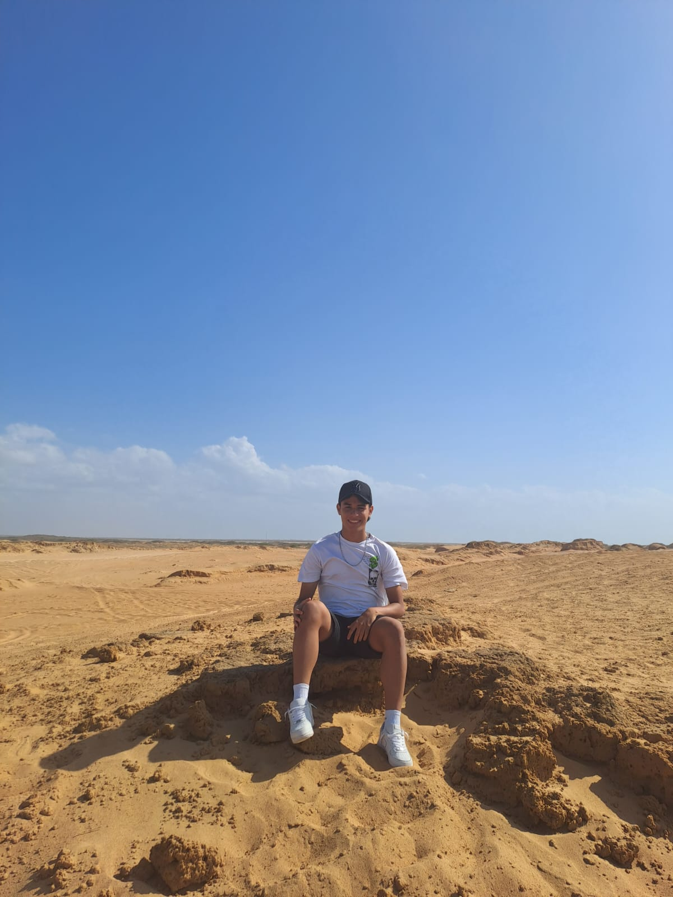

## Diego Armando Castro Duarte

¿Por qué deberían de pasar el primer corte de Backend?

- Tengo conocimientos técnicos sólidos
- Tengo experiencia en frameworks y tecnologías clave
- Manejo un código limpio y estructurado
- Buen manejo de herramientas y procesos esenciales
- Hay buena comunicación y trabajo en equipo